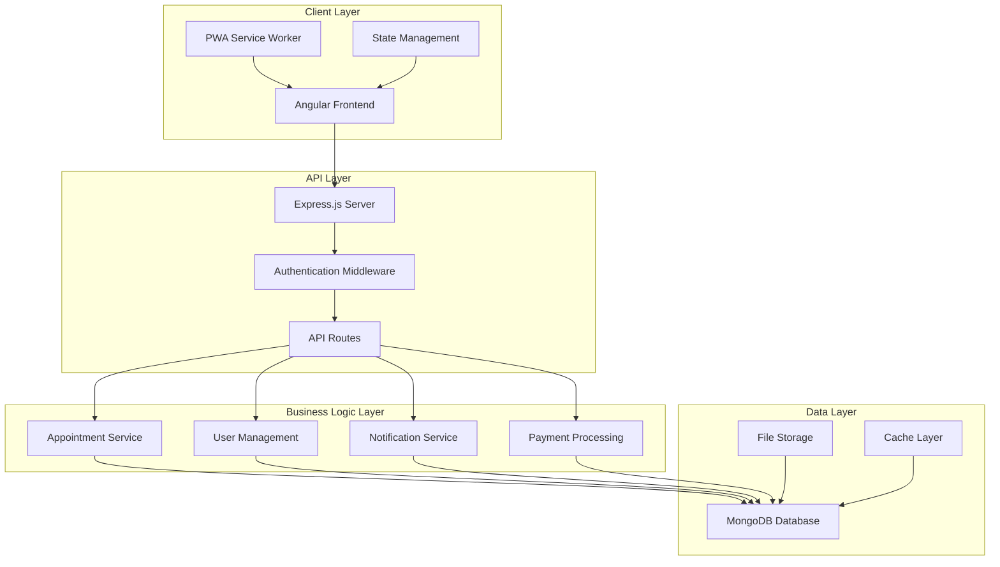

# Design Document

## Overview

The physiotherapy clinic website will be built as a modern, responsive web application using Angular 20 with Server-Side Rendering (SSR) for optimal SEO performance. The system follows a three-phase development approach: frontend implementation, backend integration, and final optimization. The architecture emphasizes modularity, scalability, and user experience while maintaining healthcare data security standards.

## Architecture

### System Architecture



### Technology Stack

**Frontend (Phase 1):**

- Angular 20 with SSR for SEO optimization
- Tailwind CSS with Flowbite UI components for responsive design
- RxJS for reactive programming
- Angular Forms for form handling
- Angular Router for navigation
- PWA capabilities for offline functionality

**Backend (Phase 2):**

- **Option A:** Node.js with Express.js, MongoDB with Mongoose ODM, JWT authentication, Nodemailer for emails
- **Option B:** Ruby on Rails with PostgreSQL/MongoDB, Devise for authentication, ActionMailer for emails
- RESTful API design with JSON responses
- File upload handling and storage
- Rate limiting and security middleware

**Infrastructure (Phase 3):**

- Docker containerization
- CI/CD pipeline
- SSL/TLS encryption
- CDN for static assets
- Monitoring and analytics

## Components and Interfaces

### Core Components Structure

```
src/app/
├── components/
│   ├── layout/
│   │   ├── header/
│   │   ├── footer/
│   │   ├── navigation/
│   │   └── sidebar/
│   ├── shared/
│   │   ├── appointment-card/
│   │   ├── service-card/
│   │   ├── staff-card/
│   │   ├── loading-spinner/
│   │   ├── modal/
│   │   └── form-controls/
│   └── features/
│       ├── appointment-booking/
│       ├── patient-portal/
│       ├── staff-dashboard/
│       └── admin-panel/
├── pages/
│   ├── home/
│   ├── services/
│   ├── about/
│   ├── contact/
│   ├── book/
│   ├── auth/
│   ├── patient/
│   ├── staff/
│   └── admin/
├── services/
│   ├── auth.service.ts
│   ├── appointment.service.ts
│   ├── user.service.ts
│   ├── notification.service.ts
│   ├── seo.service.ts
│   └── api.service.ts
├── models/
│   ├── user.model.ts
│   ├── appointment.model.ts
│   ├── service.model.ts
│   ├── staff.model.ts
│   └── clinic.model.ts
├── guards/
│   ├── auth.guard.ts
│   ├── role.guard.ts
│   └── admin.guard.ts
├── interceptors/
│   ├── auth.interceptor.ts
│   ├── error.interceptor.ts
│   └── loading.interceptor.ts
└── utils/
    ├── validators.ts
    ├── constants.ts
    └── helpers.ts
```

### Key Interface Definitions

**Appointment Management:**

```typescript
interface Appointment {
  id: string;
  patientId: string;
  staffId: string;
  serviceId: string;
  dateTime: Date;
  duration: number;
  status: 'scheduled' | 'confirmed' | 'completed' | 'cancelled';
  notes?: string;
  createdAt: Date;
  updatedAt: Date;
}

interface Service {
  id: string;
  name: string;
  description: string;
  duration: number;
  price: number;
  category: string;
  isActive: boolean;
}

interface Staff {
  id: string;
  userId: string;
  specializations: string[];
  availability: WeeklySchedule;
  isActive: boolean;
}
```

**User Management:**

```typescript
interface Patient extends User {
  dateOfBirth?: Date;
  phone: string;
  address?: Address;
  emergencyContact?: EmergencyContact;
  medicalHistory?: MedicalHistory;
  preferences?: PatientPreferences;
}

interface Address {
  street: string;
  city: string;
  state: string;
  zipCode: string;
  country: string;
}

interface MedicalHistory {
  conditions: string[];
  medications: string[];
  allergies: string[];
  previousTreatments: string[];
}
```

## Data Models

### Database Schema Design

**Users Table/Collection:**

*MongoDB Schema (Node.js/Express):*

```javascript
{
  _id: ObjectId,
  email: String (unique, required),
  password: String (hashed, required),
  firstName: String (required),
  lastName: String (required),
  role: String (enum: ['patient', 'staff', 'admin']),
  phone: String,
  isActive: Boolean (default: true),
  createdAt: Date,
  updatedAt: Date,
  lastLogin: Date
}
```

*PostgreSQL Schema (Ruby on Rails):*

```ruby
# users table
create_table :users do |t|
  t.string :email, null: false, index: { unique: true }
  t.string :password_digest, null: false
  t.string :first_name, null: false
  t.string :last_name, null: false
  t.string :role, null: false # enum: patient, staff, admin
  t.string :phone
  t.boolean :is_active, default: true
  t.datetime :last_login
  t.timestamps
end
```

**Appointments Collection:**

```javascript
{
  _id: ObjectId,
  patientId: ObjectId (ref: 'User'),
  staffId: ObjectId (ref: 'User'),
  serviceId: ObjectId (ref: 'Service'),
  dateTime: Date (required),
  duration: Number (minutes),
  status: String (enum: ['scheduled', 'confirmed', 'completed', 'cancelled']),
  notes: String,
  paymentStatus: String (enum: ['pending', 'paid', 'refunded']),
  createdAt: Date,
  updatedAt: Date
}
```

**Services Collection:**

```javascript
{
  _id: ObjectId,
  name: String (required),
  description: String,
  duration: Number (minutes),
  price: Number,
  category: String,
  isActive: Boolean (default: true),
  seoMetadata: {
    title: String,
    description: String,
    keywords: [String]
  }
}
```

### State Management Strategy

**Angular Services with RxJS:**

- Centralized state management using BehaviorSubjects
- Reactive data flow with observables
- Caching strategies for frequently accessed data
- Optimistic updates for better user experience

```typescript
@Injectable({
  providedIn: 'root'
})
export class AppointmentService {
  private appointmentsSubject = new BehaviorSubject<Appointment[]>([]);
  public appointments$ = this.appointmentsSubject.asObservable();
  
  private loadingSubject = new BehaviorSubject<boolean>(false);
  public loading$ = this.loadingSubject.asObservable();
}
```

## Error Handling

### Frontend Error Handling

**Global Error Interceptor:**

- HTTP error interception and user-friendly messages
- Automatic retry logic for transient failures
- Logging and monitoring integration
- Graceful degradation for offline scenarios

**Validation Strategy:**

- Client-side validation with Angular Reactive Forms
- Real-time validation feedback
- Custom validators for healthcare-specific data
- Accessibility-compliant error messaging

### Backend Error Handling

**Structured Error Responses:**

```typescript
interface ApiError {
  success: false;
  error: {
    code: string;
    message: string;
    details?: any;
    timestamp: Date;
  };
}
```

**Error Categories:**

- Authentication errors (401, 403)
- Validation errors (400)
- Resource not found (404)
- Server errors (500)
- Rate limiting (429)

## Testing Strategy

### Frontend Testing

**Unit Testing:**

- Component testing with Angular Testing Utilities
- Service testing with mocked dependencies
- Pipe and directive testing
- Form validation testing

**Integration Testing:**

- Component interaction testing
- Route testing with RouterTestingModule
- HTTP service testing with HttpClientTestingModule

**E2E Testing:**

- Critical user journey testing
- Appointment booking flow
- Authentication workflows
- Responsive design testing

### Backend Testing

**API Testing:**

- Endpoint testing with Jest and Supertest
- Authentication middleware testing
- Database integration testing
- Error handling verification

**Performance Testing:**

- Load testing for appointment booking
- Database query optimization
- Memory leak detection
- Response time monitoring

## SEO and Performance Optimization

### SEO Strategy

**Technical SEO:**

- Server-side rendering with Angular Universal
- Structured data markup (JSON-LD)
- XML sitemap generation
- Meta tags optimization
- Open Graph and Twitter Card support

**Content SEO:**

- Semantic HTML structure
- Proper heading hierarchy (H1-H6)
- Alt text for images
- Internal linking strategy
- Local SEO optimization

### Performance Optimization

**Frontend Performance:**

- Lazy loading for route modules
- Image optimization and WebP format
- Bundle splitting and tree shaking
- Service worker for caching
- Critical CSS inlining

**Backend Performance:**

- Database indexing strategy
- Query optimization
- Response caching
- CDN integration
- Compression middleware

### Core Web Vitals Optimization

**Largest Contentful Paint (LCP):**

- Optimize hero images
- Preload critical resources
- Minimize server response times

**First Input Delay (FID):**

- Code splitting
- Minimize JavaScript execution time
- Use web workers for heavy computations

**Cumulative Layout Shift (CLS):**

- Reserve space for images and ads
- Avoid inserting content above existing content
- Use CSS aspect-ratio for media

## Security Implementation

### Authentication and Authorization

**JWT Implementation:**

- Secure token generation and validation
- Refresh token mechanism
- Role-based access control (RBAC)
- Session management

**Password Security:**

- bcrypt hashing with salt rounds
- Password strength requirements
- Account lockout after failed attempts
- Password reset functionality

### Data Protection

**HIPAA Compliance Considerations:**

- Data encryption at rest and in transit
- Audit logging for data access
- User consent management
- Data retention policies

**Security Headers:**

- Content Security Policy (CSP)
- HTTP Strict Transport Security (HSTS)
- X-Frame-Options
- X-Content-Type-Options

### Input Validation and Sanitization

**Frontend Validation:**

- Angular form validators
- Custom validation rules
- XSS prevention
- CSRF protection

**Backend Validation:**

- Request payload validation
- SQL injection prevention
- Rate limiting
- Input sanitization

## Accessibility Implementation

### WCAG 2.1 AA Compliance

**Keyboard Navigation:**

- Tab order management
- Focus indicators
- Skip links
- Keyboard shortcuts

**Screen Reader Support:**

- ARIA labels and descriptions
- Semantic HTML elements
- Live regions for dynamic content
- Alternative text for images

**Visual Accessibility:**

- Color contrast compliance
- Scalable text support
- High contrast mode
- Reduced motion preferences

## Mobile and Responsive Design

### Responsive Breakpoints

**Tailwind CSS with Flowbite Breakpoints:**

- Mobile: 320px - 767px
- Tablet: 768px - 1023px
- Desktop: 1024px - 1279px
- Large Desktop: 1280px+

### Mobile-First Approach

**Progressive Enhancement:**

- Core functionality on mobile
- Enhanced features for larger screens
- Touch-friendly interface elements
- Optimized form inputs for mobile

### PWA Features

**Service Worker Implementation:**

- Offline functionality
- Background sync
- Push notifications
- App-like experience

**Web App Manifest:**

- Installable web app
- Custom splash screen
- Theme colors
- Display modes

This design provides a comprehensive foundation for building a modern, scalable, and user-friendly physiotherapy clinic website that meets all the requirements while following best practices for healthcare applications.
